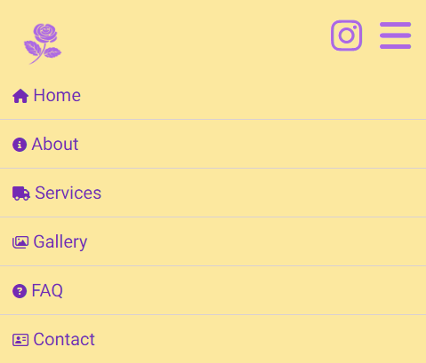
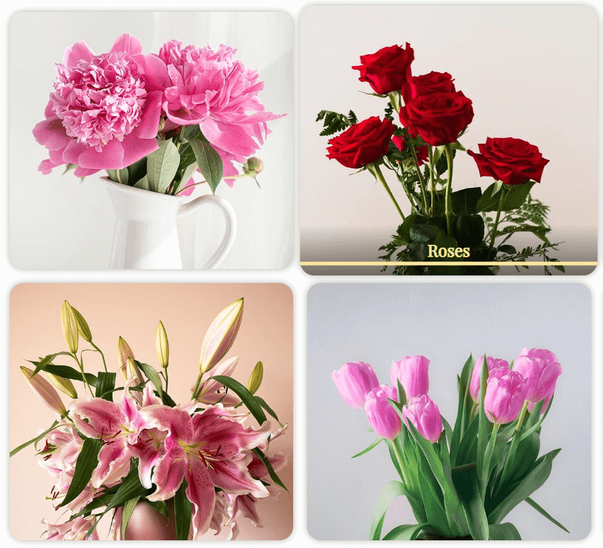
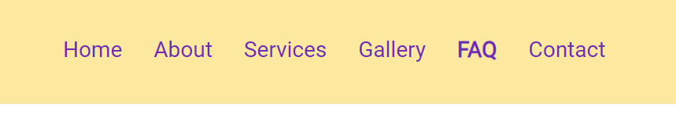
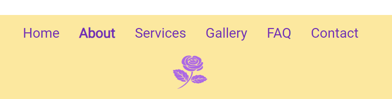

# The Flower Works

Welcome to The Flower Works README file! This has all the essential information about the florist business website.

## Introduction

The Flower Works is a renowned family-run florist specialising in exquisite floral arrangements and services. It is real business located in west London and has an online presence mainly via Instagram.

The business currently has a website; however, it could be further improved with modern design elements and enhanced features, incorporating semantic elements to create a stronger and more impactful online presence. As a result, I have undertaken a comprehensive revamp, which you can explore [here](https://sasantazayoni.github.io/The-flower-works/).

## User Experience (UX)

### User Stories

* As a user, I want to be able to understand the business brand at a first look.
* As a user, I want to be able to see the prices of products without having to search through various pages.
* As a user, I want to be able to browse through a variety of floral arrangements to see what is available to me.
* As a user, I want to be able to contact someone to ask specific questions and make delivery orders.
* As a user, I want to be able to be able to find the business location.
* As a user, I want to be able to navigate around the website easily.

### Design

Colour scheme:

This combination creates a visually appealing and captivating colour palette that is both vibrant and harmonious.

### Typography

* 'Playfair Display' is the font used for headings with a fallback of the font-stack 'Arial, Helvetica, sans-serif'. Playfair Display is aesthetically pleasing and easily readable. From the multiple suggestions online, this seemed like the most appropriate choice due its vintage appeal.
* 'Roboto' is the font used for the body text with a fallback of the font-stack 'Arial, Helvetica, sans-serif'. Roboto is optimised for web usage and is a popular pairing with Playfair Display. Roboto is also renowned for it versatility, visual appeal and accessibility therefore was a natural choice for the body text.

### Imagery

The images play a vital role in terms of the user experience on a florist website. They are able to captivate visitors and convey the beauty and essence of flowers in a way that words alone cannot. At the time of writing this README.md file, placeholder images are being used but they will be replaced with images supplied by the business owner for the final iteration of the website.

* The logo image is a simple but effective icon that can be reused across many other platforms representing the business brand.
* The hero image is purposely vibrant and beautiful and gives a positive association with the business.
* The image on the about page shows a view of the front of the business.
* The services images show a sample of some of the flowers offered by the business.
* The gallery has been carefully designed with images that are Photoshop-editted so that they are aligned centrally, showing the flowers clearly. This page is extremely important for customers and therefore extra effort has been put into its design so that all images are clear and of high-quality on all screen sizes.
* The modal images are each supplied in a larger size individually to retain the quality of the images.
* The contact page has a placeholder image and works correctly with the grid. This image will be replaced with a picture of the owner of the business.

### Overview

The website is thoughtfully crafted to emanate a vibrant sense of beauty. It seamlessly combines accessibility with small yet impactful features, creating a modern, artistic and elegantly simplistic design.

## Wireframes

All Wireframes were designed for larger screens such as laptops or computers; for medium sized screens such as tablets or large phones; and for small screens down to the smallest phone display. The wireframes can be viewed here:

[Home page](https://imgur.com/gokHG2Y) / [Home page mobile](https://imgur.com/Z3PfRbB)

[About page](https://imgur.com/nih7hYC) / [About page mobile](https://imgur.com/LneqiiU)

[Services page](https://imgur.com/f8ZBskQ) / [Services page mobile](https://imgur.com/h8ZCngu)

[Gallery page](https://imgur.com/LG0Pxkk) / [Gallery page mobile](https://imgur.com/AROpZsU)

[FAQ page](https://imgur.com/JdX95BY) / [FAQ page mobile](https://imgur.com/lYpaAaJ)

[Contact page](https://imgur.com/4oEYQZa) / [Contact page mobile](https://imgur.com/7EmRjfs)

The wireframes do not fully correspond with the end product due to multiple changes made throughout the production phase.

## Features

### Current features

* All pages are designed using Responsive Design and are fully responsive on all devices.
* The navigation menu collapses on smaller viewports allowing for a more compact view.
* The company logo only displays an icon in smaller viewports for simplicity.
    
     Logo:
    
     
     Small logo:
    
     
    
* Instagram icon has a tooltip hover-effect for clarity.
   
    
   
* The drop-down menu on the navigation bar has small icons as bullet points that represent the text.
   
    
   
* All anchor links have a visual effect that brightens when hovered over.
   
    
   
* All buttons have a visual effect that brightens the text when hovered over as well as an additional ripple effect for aesthetics.
   
    
   
* All pages have a navigation button in the bottom right corner to be able to navigate to the top of the page which only appears when scrolling down from the navigation bar.
   
    
   
* The testimonials section on the home page features interactive buttons for switching between different testimonials, accompanied by tabs that indicate the corresponding testimonial numbers.
   
    Testimonials tabs:
   
    
   
    Testimonials buttons:
   
     
   
* The gallery page has been carefully engineered to showcase flowers on all viewports with a hover effect that elegantly reveals the name of the flowers.
   
    
   
* When clicking on each flower image on the gallery page, a modal image is triggered, providing an enlarged and detailed view.
   
    
   
* The enquiries form on the contact page is integrated with the backend server, formspree.io. This integration facilitates efficient handling of enquiries, ensuring that they are directly forwarded to the company's designated email address.
   
    
   
* The contact page also features an embedded Google Maps location, providing a visual representation of the company's address for easy reference.
   
    
   
## Future features

* To enhance customer feedback and engagement, an optional reviews section can be integrated as an extension to the contact page, allowing customers to share their valuable reviews and experiences with the business.
* To streamline the ordering process, provide responsive customer support, and gather valuable feedback, the introduction of a chatbot with notifications can enhance the website's functionality. The chatbot will facilitate order placement, address customer inquiries, and enable efficient communication for an enhanced user experience.
* To facilitate communication and provide quick assistance, the addition of a live chat feature allows users to easily connect with the florist. This feature enables direct interaction, allowing customers to inquire about availability, explore delivery options, and seek answers to any other inquiries they may have.

## Technologies used

### Languages

* HTML5
* CSS3
* JavaScript

## Frameworks, libraries and programs used

* [Font Awesome](https://fontawesome.com/) used for icons.
* [Coolors](https://coolors.co/) used to display colour palette used on the website.
* [Looka](https://looka.com/) used to create brand logo.
* [imgur](https://imgur.com/) used to host wireframe images.
* [Google Fonts](https://fonts.google.com/) used to import 'Playfair Display' and 'Roboto' fonts.
* [Google Maps](https://www.google.co.uk/maps) used to import business location to the contact page.
* [Github](https://github.com/) used to host repository.
* [Codeanywhere](https://app.codeanywhere.com/) used to develop project and organise version control.
* [Github pages](https://pages.github.com/) used to deploy the website.
* [Lighthouse](https://developer.chrome.com/docs/lighthouse/overview/) used for performance review.
* [Caniuse](https://caniuse.com/) used to check compatibility of code syntax with other browsers.
* [PowerMapper](https://www.powermapper.com/) used to check compatibility of website with other browsers.
* [Amiresposive](https://amiresponsive.co.uk/) used to display website on the most common devices.
* [Responsinator](http://www.responsinator.com/) used to check if site was responsive on different screen sizes.
* [Photoshop](https://www.adobe.com/uk/products/photoshop/) used to resize photos.
* [Tinypng](https://tinypng.com/) used to compress image files for better performance.
* [Block-element-modifier naming convention](https://www.geeksforgeeks.org/understanding-the-css-bem-convention/) used for naming CSS classes.
* [AOS animations](https://github.com/michalsnik/aos) is a library used to offer dynamic JavaScript-based animations that can be utilised to create captivating visual effects, including smooth fade-ins and delightful flipping transitions throughout the website.
* [Formspree](https://formspree.io/) used in the enquiries form to provide a backend, enabling efficient routing of email enquiries directly to the business owner.
* [ChatGPT](https://chat.openai.com/) used to generate placeholder text and to verify code.
* [Unsplash](https://unsplash.com/) used to obtain placeholder pictures for the gallery and services page.
* [Pexels](https://www.pexels.com/) used to obtain placeholder pictures for the gallery and services page, and the hero image on the home page.
* [The Flower Works Instagram](https://www.instagram.com/flowerworksw10/?hl=en-gb) used with permission from business owners for placeholder images for the about and contact page.
* [StackOverflow](https://stackoverflow.com/) used to problem solve and deal with queries.
* [Cloudconvert](https://cloudconvert.com/) used to convert images to webp format.

## Testing

### Validating

At the completion or heavy editing of sections, I used the following websites to check my code for syntax errors:

* [HTML validator](https://validator.w3.org/)
* [CSS validator](https://jigsaw.w3.org/css-validator/)
* [JavaScript validator](https://esprima.org/demo/validate.html)

### Testing User Stories from (UX) section

* As a user, I want to be able to understand the business brand at a first look.
    * The hero image prominently conveys the essence of the business as a florist on the home page, while the logo effectively captures and represents the brand identity of the business. Furthermore, the name 'The       
Flower Works' distinctly emphasizes and signifies the nature of the business.
    * Screenshot of the home page hero image:
       
        

* As a user, I want to be able to see the prices of products without having to search through various pages.
    * The pricing of flowers is determined based on the specific type of order or requested service. The home page provides an overview of the pricing, while the services page offers a comprehensive breakdown of the different pricing options available.
    * Screenshot of the pricing overview on the home page:
       
        
    * Screenshot of the full pricing breakdown on the services page:
       
        

* As a user, I want to be able to browse through a variety of floral arrangements to see what is available to me.
    * The gallery page offers a comprehensive showcase of various floral arrangements, each accompanied by a dedicated large image for closer examination. It's important to note that while the gallery provides a rich display, it may not encompass the entirety of available options as certain flowers are subject to seasonal availability.
    * Screenshot of a part of the gallery page:
       
        
    * Screenshot of the open modal:
       
        
 
* As a user, I want to be able to contact someone to ask specific questions and make delivery orders.
    * The contact page provides an email address, an enquiries form and a contact number along with the business' opening times for convenience.
    * Screenshot of contact card on contact page:
       
        
    * Screenshot of enquiries form on contact page:
       
        
  
* As a user, I want to be able to be able to find the business location.
    * The contact page features an embedded Google Maps location that includes an image and the business address, allowing users to easily locate and navigate to our establishment.
    * Screenshot of Google Maps:
       
        

* As a user, I want to be able to navigate around the website easily.
    * In addition to the navigation links positioned at the top and bottom of every page, the website incorporates prominently labeled buttons for seamless navigation throughout the site. Furthermore, a conveniently located button in the bottom right corner allows users to effortlessly return to the top of each page.
    * Screenshot of navigation bar navigation links:
       
        
    * Screenshot of footer navigation links:
       
        
    * Screenshot of some buttons:
    *  
        
    * Screenshot of scroll up button:
       
        

### Personal testing

* Samsung Galaxy S9
     * Google Chrome
     * Mozilla Firefox
     * Microsoft Edge
     * Samsung Internet
* iPhone 6
     * Safari
* iPhone SE
     * Safari
     * Google Chrome
* iPhone 12 Mini
     * Safari
* iPhone 14
     * Safari
* iPad 11" Pro
     * Safari
* Aorus 7
     * Google Chrome
     * Mozilla Firefox
     * Microsoft Edge
     * Opera
     * Brave

### Responsinator

When there were browsers that were inaccessible at the time of testing, responsinator was used to make sure that the website was fully responsive on all devices. The results can be viewed for the following:

[Home page](http://www.responsinator.com/?url=sasantazayoni.github.io%2FThe-flower-works%2F)  
[About page](http://www.responsinator.com/?url=sasantazayoni.github.io%2FThe-flower-works%2Fabout.html)  
[Services page](http://www.responsinator.com/?url=sasantazayoni.github.io%2FThe-flower-works%2Fservices.html)  
[Gallery page](http://www.responsinator.com/?url=sasantazayoni.github.io%2FThe-flower-works%2Fgallery.html)  
[FAQ page](http://www.responsinator.com/?url=sasantazayoni.github.io%2FThe-flower-works%2Ffaq.html)  
[Contact page](http://www.responsinator.com/?url=sasantazayoni.github.io%2FThe-flower-works%2Fcontact.html)  

### Third-Party Testing

One of the most helpful ways to test throughout the establishment of this website was to have a few different people test it on various devices.

| Name | Age | Florist BG | Tech BG |
| --- | --- | --- | --- |
| Laura | 36 | High | None |
| Amy | 36 | None | High |
| Nathalie | 45 | None | High |
| Zara | 65 | None | None |
| Saba | 30 | None | High |

### Lighthouse

Lighthouse was a helpful tool for checking where where the website was experiencing the most issues.

The results indicate that the website is of excellent quality. There are a few issues that were raised:

* High quality images can be a detriment to users with a slow connection speed and therefore need further optimisation. Since the existing pictures are all placeholders, it is unnecessary to optimise until the real pictures are delivered.
* List items should be direct children of a unordered list or ordered list element for proper list structure. While this doesn't significantly impact accessibility, it's a best practice to keep in mind for future projects.
* The website may have some font sizes that are too small for optimal readability on mobile screens (below 12px). While the font sizes are never below 10px, it is recommended to adhere to a minimum of 12px for text to ensure better mobile-friendly experience and readability for future projects.

### PowerMapper

As the results show, the website is highly compatible across all browsers.

### Bugs

* There are no known bugs and any that existed were promptly addressed and fixed.

## Deployment

1. Log into [GitHub](https://github.com/).
2. Locate the [repository](https://github.com/SasanTazayoni/The-flower-works).
3. Locate the settings option along the options bar at the top of the page.
4. Locate the 'Pages' option on the left side bar and click on it.
5. Under the 'Branch' subheading there should be a drop-down menu - select 'Master' from the branch options.
6. Click the save button.
7. Github pages will build your website with the code supplied and begin hosting it when it is completed - the process usually takes a few minutes.
8. The website URL will now be visible on the green bar under the section header. This will remain there permanently and you can refer back to it at any time.

## Credits

* Thanks to [Kevin Powell](https://www.youtube.com/@KevinPowell) and [WebDevSimplified](https://www.youtube.com/@WebDevSimplified) from YouTube for best practices in code.
* Thanks to [Programming with Mosh](https://www.youtube.com/@programmingwithmosh) from YouTube for image optimisation techniques and knowledge of useful web applications.
* Thanks to Jackie & Laura for inspiration to make this website.
* Thanks to my friends and family for thoroughly testing out my website and giving useful suggestions (especially Amy).
* Thanks to my mentor Antonio Rodriguez for the helpful direction in starting this project and all of the helpful resources provided that helped throughout.
